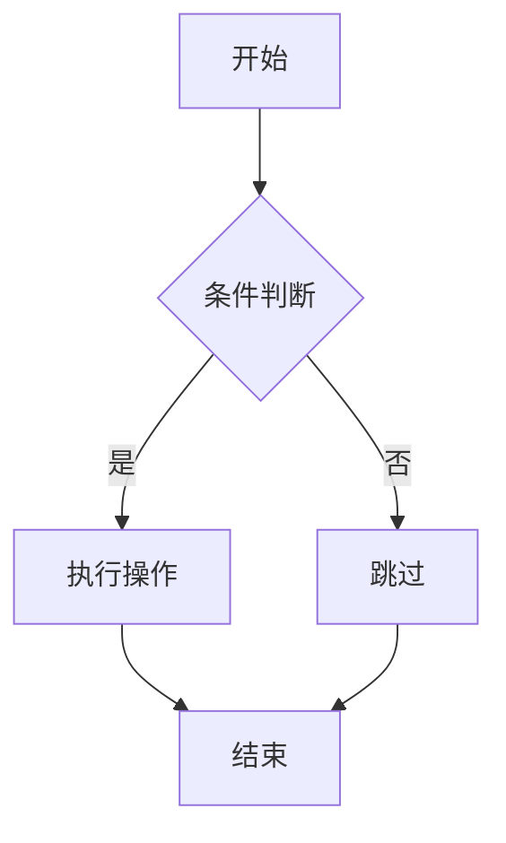
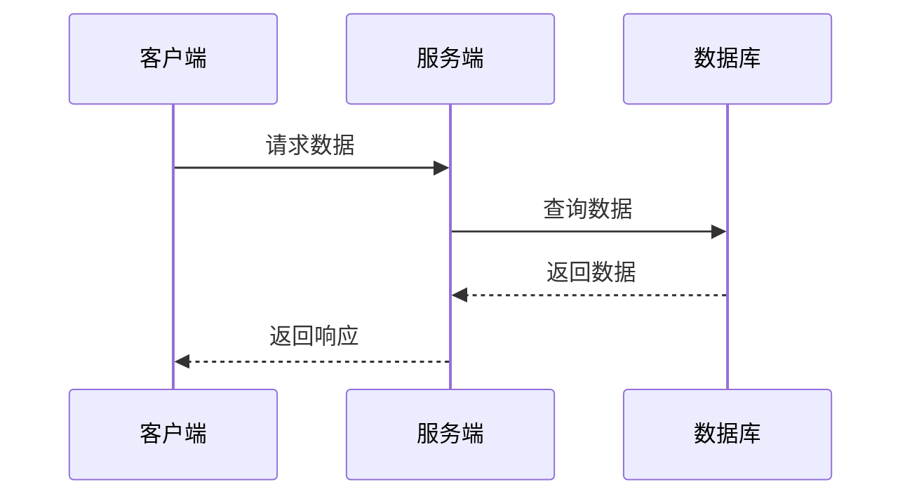

# 项目文档格式标准

## 1. 文档格式规范

### 1.1 Markdown 文件命名规则
- 使用英文小写字母、数字和连字符 `-`
- 文件名应清晰描述内容，如：`api-documentation.md`
- 避免使用空格和特殊字符

### 1.2 标题层级规范

| 层级 | 语法 | 字体样式 | 使用场景 |
|------|------|----------|----------|
| 一级 | `# 标题` | 24px, 粗体, 黑色 | 文档主标题 |
| 二级 | `## 标题` | 20px, 粗体, 深灰色 | 章节标题 |
| 三级 | `### 标题` | 18px, 粗体, 深灰色 | 子章节标题 |
| 四级 | `#### 标题` | 16px, 粗体, 灰色 | 小节标题 |

### 1.3 文本样式规范

- **粗体**：`**文本内容**`，用于强调重要内容
- *斜体*：`*文本内容*`，用于引用或注释
- ~~删除线~~：`~~文本内容~~`，用于表示已废弃内容
- `行内代码`：`` `代码内容` ``，用于表示代码片段或变量名

### 1.4 代码块规范

#### 代码块格式
```language
代码内容
```

#### 支持的语言
- Python: `python`
- JavaScript/TypeScript: `javascript` / `typescript`
- Vue: `vue`
- SQL: `sql`
- JSON: `json`
- Shell: `bash`

#### 代码块示例
```python
def hello_world():
    """打印问候语"""
    print("Hello, World!")
```

### 1.5 列表规范

#### 无序列表
- 项目1
- 项目2
  - 子项目2.1
  - 子项目2.2

#### 有序列表
1. 第一步
2. 第二步
   1. 子步骤2.1
   2. 子步骤2.2

### 1.6 表格规范

| 表头1 | 表头2 | 表头3 |
|-------|-------|-------|
| 内容1 | 内容2 | 内容3 |
| 内容4 | 内容5 | 内容6 |

**注意事项**：
- 表格必须包含表头
- 列对齐使用 `:` 控制（`:---` 左对齐，`:---:` 居中，`---:` 右对齐）

### 1.7 链接规范

#### 内部链接
- 文档链接：`[链接文本](相对路径)`
- 示例：`[API文档](./api-documentation.md)`

#### 外部链接
- `[链接文本](URL)`
- 示例：`[Vue官方文档](https://vuejs.org/)`

### 1.8 图片规范

```markdown

```

**注意事项**：
- 图片应存放在 `docs/assets/` 目录下
- 图片格式优先使用 PNG 或 WebP
- 图片描述应简洁清晰

### 1.9 引用规范

> 这是一段引用内容
> 
> 可以包含多行

## 2. README 文件结构模板

```markdown
# 项目名称

## 项目概述

简要描述项目的目的、功能和价值。

## 技术栈

### 前端技术
- 框架名称及版本
- 状态管理库
- 路由库
- 构建工具
- 样式方案

### 后端技术
- 框架名称及版本
- 数据库类型
- ORM框架
- 其他依赖

## 项目结构

```
目录结构
```

## 核心功能

### 功能模块1
- 功能描述
- 关键特性

### 功能模块2
- 功能描述
- 关键特性

## 快速开始

### 环境要求
- Node.js 版本要求
- Python 版本要求
- 其他依赖

### 安装步骤
1. 克隆仓库
2. 安装依赖
3. 配置环境变量
4. 启动服务

### 运行命令
| 命令 | 描述 |
|------|------|
| `npm run dev` | 启动开发服务器 |
| `npm run build` | 构建生产版本 |
| `npm run lint` | 代码检查 |

## API 接口

### 接口列表

| 接口路径 | HTTP方法 | 功能描述 |
|----------|----------|----------|
| `/api/users` | GET | 获取用户列表 |
| `/api/users` | POST | 创建用户 |

## 贡献指南

### 代码规范
- 前端：ESLint + Prettier
- 后端：flake8

### 提交规范
- feat: 新增功能
- fix: 修复bug
- docs: 文档更新
- style: 代码格式
- refactor: 代码重构
- test: 测试更新

## 许可证

MIT License

## 联系方式

- 作者：姓名
- 邮箱：email@example.com
```

## 3. API 文档结构模板

```markdown
# API 接口文档

## 基础信息

- **基础URL**: `http://localhost:5000/api`
- **认证方式**: JWT Token
- **数据格式**: JSON

## 接口列表

### 1. 用户管理

#### 1.1 获取用户列表

**请求**
- **路径**: `/users`
- **方法**: GET
- **参数**:
  | 参数名 | 类型 | 必填 | 描述 |
  |--------|------|------|------|
  | page | int | 否 | 页码 |
  | size | int | 否 | 每页数量 |

**响应**
```json
{
  "code": 200,
  "message": "success",
  "data": {
    "list": [...],
    "total": 100
  }
}
```

#### 1.2 创建用户

**请求**
- **路径**: `/users`
- **方法**: POST
- **Body**:
```json
{
  "name": "string",
  "email": "string",
  "password": "string"
}
```

**响应**
```json
{
  "code": 201,
  "message": "创建成功",
  "data": {...}
}
```

### 2. 错误码说明

| 错误码 | 描述 |
|--------|------|
| 400 | 请求参数错误 |
| 401 | 未授权 |
| 403 | 无权限 |
| 404 | 资源不存在 |
| 500 | 服务器错误 |
```

## 4. 技术文档结构模板

```markdown
# 技术文档

## 1. 架构设计

### 1.1 架构概述
- 架构风格：如微服务、单体应用等
- 设计原则：如单一职责、开闭原则等

### 1.2 架构图

```
架构描述
```

### 1.3 模块划分

| 模块 | 职责 | 说明 |
|------|------|------|
| 模块1 | 描述职责 | 详细说明 |

## 2. 目录结构

```
项目根目录/
├── 目录1/           # 用途说明
├── 目录2/           # 用途说明
└── 文件1            # 用途说明
```

## 3. 关键类/函数说明

### 3.1 类名

**功能描述**：简要说明类的职责

**核心方法**：
| 方法名 | 功能 | 参数 | 返回值 |
|--------|------|------|--------|
| method1 | 描述 | 参数说明 | 返回说明 |

**设计思路**：说明设计考虑和实现要点

## 4. 数据库设计

### 4.1 ER图

### 4.2 表结构

#### 表名

| 字段名 | 类型 | 约束 | 说明 |
|--------|------|------|------|
| id | int | PRIMARY KEY | 主键 |
| name | varchar(50) | NOT NULL | 名称 |

## 5. 安全性考虑

- 输入验证
- 权限控制
- 数据加密
- 防止SQL注入
- 防止XSS攻击

## 6. 性能优化

- 缓存策略
- 数据库优化
- 代码优化
```

## 5. 流程图规范

### 5.1 流程图语法

使用 Mermaid 语法绘制流程图：



### 5.2 时序图语法



## 6. 版本控制规范

### 6.1 分支策略

- `main`：主分支，稳定版本
- `develop`：开发分支，功能集成
- `feature/*`：功能分支，开发新功能
- `bugfix/*`：修复分支，修复bug
- `release/*`：发布分支，准备发布

### 6.2 提交信息规范

```
类型(模块): 简要描述

详细描述（可选）
```

**类型说明**：
- feat：新增功能
- fix：修复bug
- docs：文档更新
- style：代码格式（不影响逻辑）
- refactor：代码重构
- test：测试更新
- chore：构建/工具更新

### 6.3 标签规范

使用语义化版本号：`v1.0.0`

## 7. 附录

### 7.1 常用命令

| 命令 | 描述 |
|------|------|
| 命令1 | 说明 |

### 7.2 参考链接

- [链接1](URL)
- [链接2](URL)