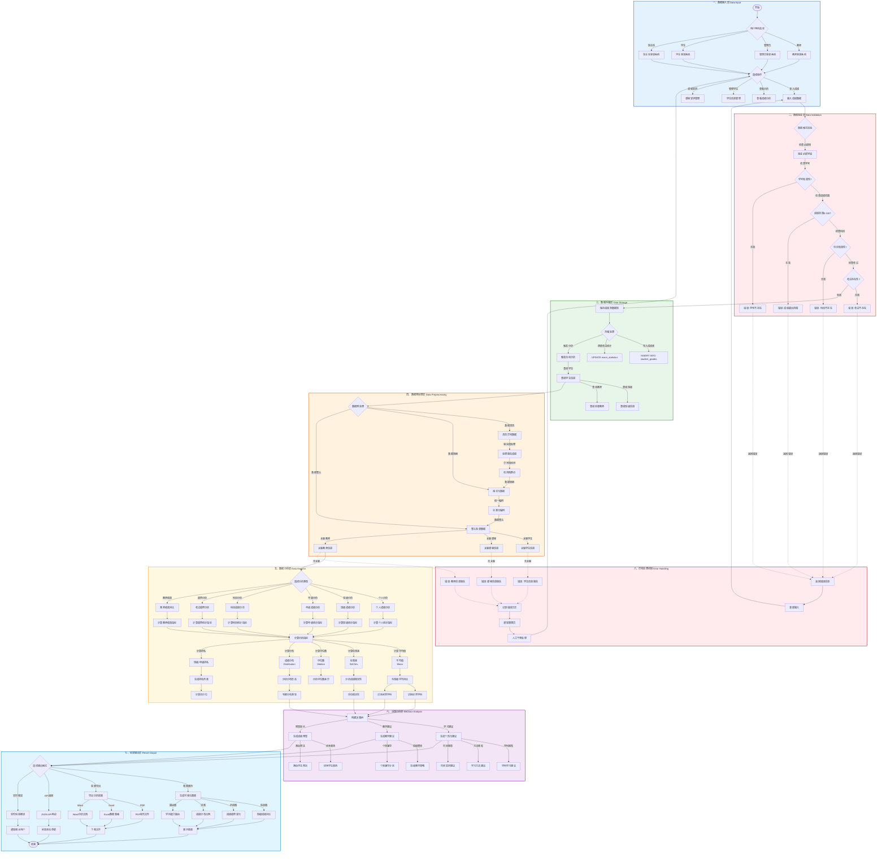

# 学校管理系统 - 成绩分析系统业务流程图

## 一、成绩分析完整生命周期流程



## 二、个人成绩分析详细流程

```mermaid
flowchart TB
    subgraph PersonalAnalysis["个人成绩分析流程"]
        startPA([开始个人分析]) --> inputStudentID[输入学生学号]

        inputStudentID --> validateStudent{学生存在性验证}
        validateStudent -->|存在| queryStudentInfo[查询学生基本信息]
        validateStudent -->|不存在| returnError1[返回错误: 学生不存在]

        queryStudentInfo --> queryGrades[查询该学生所有成绩]
        queryGrades --> checkGrades{是否有成绩?}

        checkGrades -->|无成绩| returnNoGrade[返回: 暂无成绩记录]
        checkGrades -->|有成绩| continueAnalysis

        continueAnalysis --> organizeByExam[按考试组织成绩]
        organizeByExam --> organizeBySubject[按科目整理]

        organizeBySubject --> calculateSubjectAvg[计算各科目平均分]
        calculateSubjectAvg --> calculateOverallAvg[计算整体平均分]

        calculateOverallAvg --> queryClassAvg[查询班级平均成绩]
        queryClassAvg --> compareWithClass[与班级平均对比]

        compareWithClass --> identifyStrong{优势学科?}
        identifyStrong -->|成绩>班级平均| addToStrengths[标记为优势学科]

        identifyStrong --> identifyWeak{劣势学科?}
        identifyWeak -->|成绩<班级平均| addToWeaknesses[标记为劣势学科]

        addToStrengths --> sortByDiff[按差异排序]
        addToWeaknesses --> sortByDiff

        sortByDiff --> top3Strengths[选取前3优势学科]
        sortByDiff --> top3Weaknesses[选取前3劣势学科]

        top3Strengths --> generateEval[生成综合评价]
        top3Weaknesses --> generateEval

        generateEval -->|整体优秀| eval1["评价: 优秀"]
        generateEval -->|高于平均| eval2["评价: 良好"]
        generateEval -->|接近平均| eval3["评价: 中等"]
        generateEval -->|低于平均| eval4["评价: 需提高"]

        eval1 --> buildResult[构建分析结果]
        eval2 --> buildResult
        eval3 --> buildResult
        eval4 --> buildResult

        buildResult -->|返回JSON| endPA([返回分析结果])
        returnError1 --> endPA
        returnNoGrade --> endPA
    end

    style startPA fill:#E3F2FD,stroke:#1565C0
    style endPA fill:#E8F5E9,stroke:#2E7D32
    style returnError1 fill:#FFEBEE,stroke:#C62828
    style returnNoGrade fill:#FFF3E0,stroke:#E65100
```



## 三、班级成绩分析详细流程

```mermaid
flowchart TB
    subgraph ClassAnalysis["班级成绩分析流程"]
        startCA([开始班级分析]) --> inputClassInfo[输入班级信息]

        inputClassInfo --> validateClass{班级存在性验证}
        validateClass -->|存在| queryClassStudents[查询班级学生列表]
        validateClass -->|不存在| returnError2[返回错误: 班级不存在]

        queryClassStudents --> countStudents{学生数量>0?}
        countStudents -->|是| continueCA
        countStudents -->|否| returnNoStudents[返回: 班级无学生]

        continueCA --> queryAllGrades[查询班级所有成绩]
        queryAllGrades --> checkClassGrades{是否有成绩?}

        checkClassGrades -->|无成绩| returnNoClassGrade[返回: 暂无成绩]
        checkClassGrades -->|有成绩| organizeByStudent

        organizeByStudent --> organizeByExam[按考试组织]
        organizeByExam --> organizeBySubjectCA[按科目整理]

        organizeBySubjectCA --> calculateSubjectAvgCA[计算各科目班级平均]
        calculateSubjectAvgCA --> calculateClassOverall[计算班级整体平均]

        calculateClassOverall --> calculateClassStats[计算班级统计数据]
        calculateClassStats -->|最高分| findMax[找出最高分]
        calculateClassStats -->|最低分| findMin[找出最低分]
        calculateClassStats -->|平均分| calcClassAvg[重新计算平均]

        findMax --> generateClassReport[生成班级分析报告]
        findMin --> generateClassReport
        calcClassAvg --> generateClassReport

        generateClassReport -->|学科对比| subjectCompare[班级各学科对比]
        generateClassReport -->|学生排名| studentRanking[学生成绩排名]
        generateClassReport -->|考试分析| examAnalysis[历次考试分析]

        subjectCompare -->|超过年级平均| classStrength[班级优势学科]
        subjectCompare -->|低于年级平均| classWeakness[班级劣势学科]

        studentRanking -->|前10%| topStudents[优秀学生名单]
        studentRanking -->|后10%| bottomStudents[需要关注学生]

        examAnalysis -->|成绩上升| improveTrend[进步趋势]
        examAnalysis -->|成绩下降| declineTrend[退步趋势]
        examAnalysis -->|成绩稳定| stableTrend[稳定状态]

        classStrength --> buildClassResult[构建班级分析结果]
        classWeakness --> buildClassResult
        topStudents --> buildClassResult
        bottomStudents --> buildClassResult
        improveTrend --> buildClassResult
        declineTrend --> buildClassResult
        stableTrend --> buildClassResult

        buildClassResult --> endCA([返回班级分析结果])
        returnError2 --> endCA
        returnNoStudents --> endCA
        returnNoClassGrade --> endCA
    end

    style startCA fill:#E8F5E9,stroke:#2E7D32
    style endCA fill:#E1F5FE,stroke:#0277BD
    style returnError2 fill:#FFEBEE,stroke:#C62828
```



## 四、统计分析算法流程

```mermaid
flowchart TB
    subgraph Statistics["统计分析算法流程"]
        subgraph Input["统计输入"]
            scoresInput([输入成绩列表]) --> validateScores
            validateScores -->|非空| continueStats
            validateScores -->|为空| returnZero[返回零值]
        end

        continueStats -->|计算均值| calcMean
        subgraph MeanCal["平均值计算"]
            calcMean --> sumScores["求和 Σx"]
            sumScores --> countScores["计数 n"]
            sumScores --> divideSum["sum / n"]
            divideSum --> meanResult["结果: x̄"]
        end

        meanResult -->|计算标准差| calcStd
        subgraph StdCal["标准差计算"]
            calcStd --> diffFromMean["(x - x̄)²"]
            diffFromMean --> sumSquared["求和"]
            sumSquared --> divideByN["sum / (n-1)"]
            divideByN --> sqrtVariance["√方差"]
            sqrtVariance --> stdResult["结果: s"]
        end

        stdResult -->|计算中位数| calcMed
        subgraph MedianCal["中位数计算"]
            calcMed --> sortScores["排序"]
            sortScores --> findMiddle{"奇数/偶数?"}
            findMiddle -->|奇数| middleOdd["中间值"]
            findMiddle -->|偶数|"中间两值平均"
            middleOdd --> medianResult["结果: Md"]
        end

        medianResult -->|计算分布| calcDist
        subgraph DistCal["分布统计"]
            calcDist --> countExcellence[计数90-100分]
            calcDist --> countGood[计数80-89分]
            calcDist --> countAverage[计数70-79分]
            calcDist --> countPass[计数60-69分]
            calcDist --> countFail[计数0-59分]

            countExcellence --> distResult["分布结果"]
            countGood --> distResult
            countAverage --> distResult
            countPass --> distResult
            countFail --> distResult
        end

        distResult -->|计算百分位| calcPercentile
        subgraph PercentileCal["百分位计算"]
            calcPercentile --> sortForPercentile["排序"]
            sortForPercentile --> calcPosition["位置 = P/100 × (n+1)"]
            calcPosition --> findValue["确定百分位值"]
            findValue --> percentileResult["百分位结果"]
        end

        percentileResult --> outputStats([输出统计结果])

        returnZero --> outputStats
    end

    subgraph Formulas["计算公式"]
        formula1["x̄ = Σx / n"]
        formula2["s = √[Σ(x-x̄)²/(n-1)]"]
        formula3["Md = 中间值"]
        formula4["P = (k/n) × 100%"]
    end

    style Input fill:#E3F2FD
    style MeanCal fill:#E8F5E9
    style StdCal fill:#FFF3E0
    style MedianCal fill:#FCE4EC
    style DistCal fill:#F3E5F5
    style PercentileCal fill:#E1F5FE
    style Formulas fill:#ECEFF1
```

## 五、流程图图例与符号规范

### 标准流程图符号

| 符号 | 名称 | 含义 |
|------|------|------|
| <span style="display:inline-block;width:80px;height:40px;background:#E3F2FD;border:2px solid #1565C0;border-radius:50%;text-align:center;line-height:40px;">开始/结束</span> | 圆角矩形 | 流程的起点和终点 |
| <span style="display:inline-block;width:100px;height:40px;background:#E8F5E9;border:2px solid #2E7D32;text-align:center;line-height:40px;">处理过程</span> | 矩形 | 普通执行步骤 |
| <span style="display:inline-block;width:100px;height:40px;background:#FFF3E0;border:2px solid #E65100;text-align:center;line-height:40px;">判断决策</span> | 菱形 | 条件判断分支 |
| <span style="display:inline-block;width:120px;height:40px;background:#FCE4EC;border:2px solid #AD1457;text-align:center;line-height:40px;">输入/输出</span> | 平行四边形 | 数据输入输出 |
| <span style="display:inline-block;width:80px;height:40px;background:#F3E5F5;border:2px solid #7B1FA2;border-radius:50%;text-align:center;line-height:40px;">子流程</span> | 圆角矩形 | 调用的子流程 |

### 颜色编码

| 颜色 | 流程阶段 | 说明 |
|------|---------|------|
| <span style="background:#E3F2FD;padding:5px;border-radius:3px;">浅蓝</span> | 数据输入层 | 用户操作和数据录入 |
| <span style="background:#FFEBEE;padding:5px;border-radius:3px;">浅红</span> | 数据验证层 | 数据校验和异常处理 |
| <span style="background:#E8F5E9;padding:5px;border-radius:3px;">浅绿</span> | 数据存储层 | 数据持久化和查询 |
| <span style="background:#FFF3E0;padding:5px;border-radius:3px;">浅橙</span> | 数据预处理层 | 数据清洗和转换 |
| <span style="background:#FFF8E1;padding:5px;border-radius:3px;">浅黄</span> | 数据分析层 | 统计计算和分析 |
| <span style="background:#F3E5F5;padding:5px;border-radius:3px;">浅紫</span> | 决策分析层 | 决策树和建议生成 |
| <span style="background:#E1F5FE;padding:5px;border-radius:3px;">浅青</span> | 结果输出层 | 图表和报表输出 |

### 业务节点说明

| 节点类别 | 描述 | 示例 |
|---------|------|------|
| 关键业务节点 | 核心业务逻辑执行点 | 成绩录入、统计分析、报告生成 |
| 决策判断点 | 条件分支判断 | 校验通过/失败、成绩等级判断 |
| 分支流程 | 不同路径处理 | 教师/管理员/学生不同操作 |
| 异常处理 | 错误和异常情况 | 数据不存在、验证失败 |
| 数据流转 | 数据在各层间传递 | API调用、数据库查询 |

---

**文档版本**: 2.0
**生成日期**: 2026-04-28
**流程标准**: UML活动图规范 + BPMN业务流程建模标准
