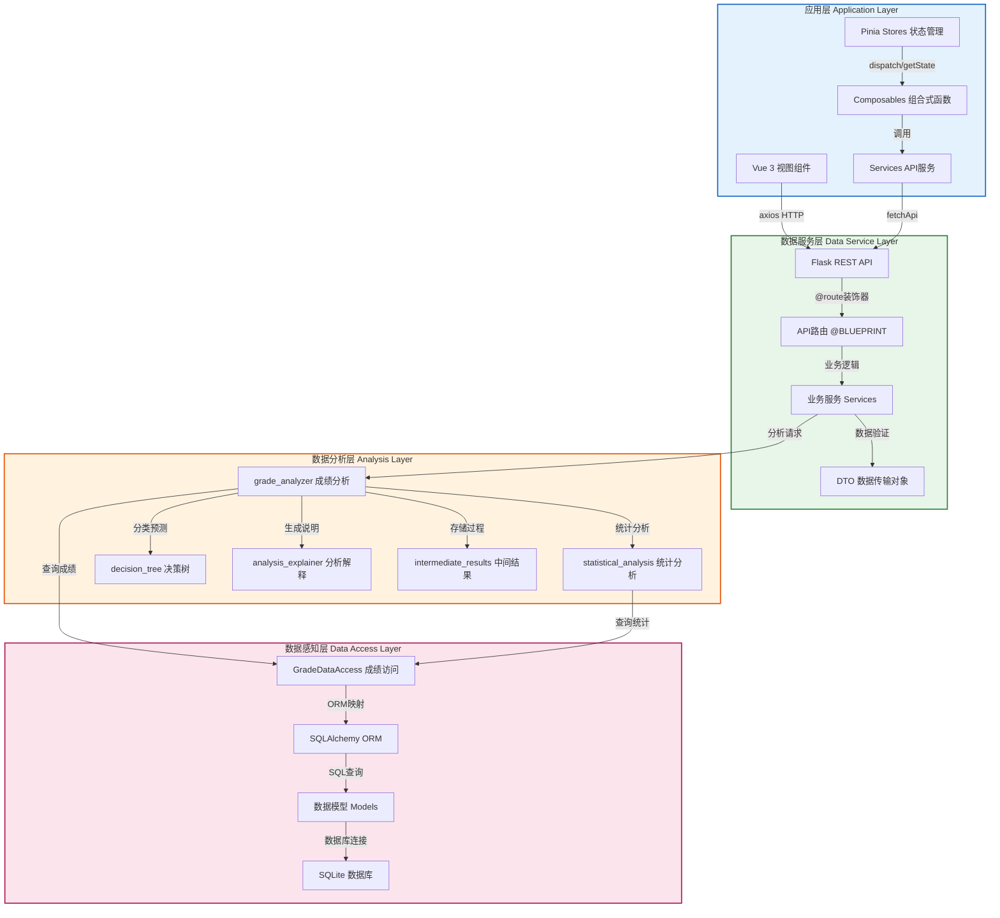
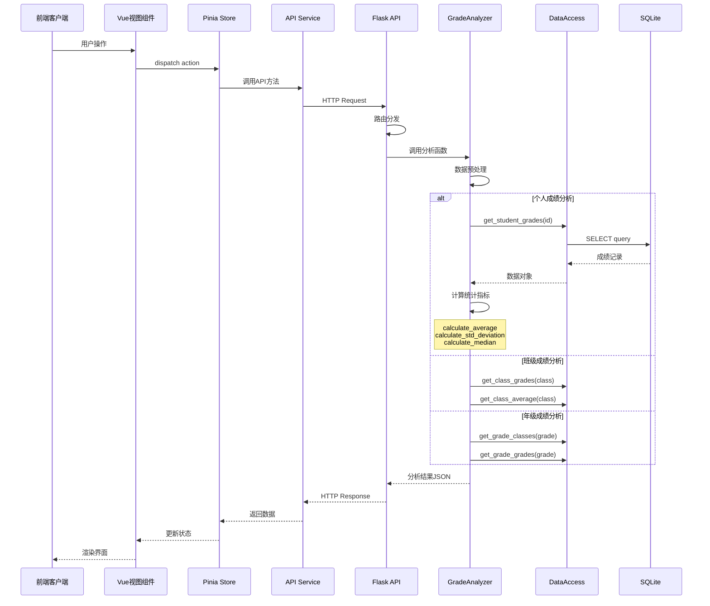
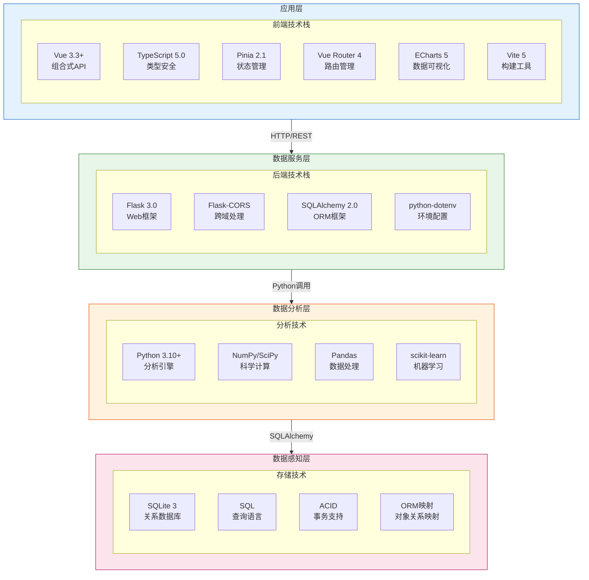

# 学校管理系统 - 系统分层架构图

## 一、系统四层架构总览

```mermaid
flowchart TB
    subgraph ApplicationLayer["应用层 Application Layer"]
        direction TB
        style ApplicationLayer fill:#E3F2FD,stroke:#1565C0,stroke-width:3

        subgraph Presentation["展示层 Presentation"]
            direction LR
            Views["视图组件<br/>Views"]
            Components["Vue组件<br/>Components"]
            Layouts["布局组件<br/>Layouts"]
        end

        subgraph BusinessLogic["业务逻辑层"]
            direction LR
            Composables["组合式函数<br/>Composables"]
            Stores["Pinia状态<br/>Stores"]
            Router["Vue Router<br/>路由管理"]
        end

        subgraph Services["服务层"]
            direction LR
            GradeService["gradeService<br/>成绩服务"]
            StudentService["studentService<br/>学生服务"]
            TeacherService["teacherService<br/>教师服务"]
            CourseService["courseService<br/>课程服务"]
            ExamService["examService<br/>考试服务"]
            APIService["apiService<br/>API基础服务"]
        end
    end

    subgraph DataServiceLayer["数据服务层 Data Service Layer"]
        direction TB
        style DataServiceLayer fill:#E8F5E9,stroke:#2E7D32,stroke-width:3

        subgraph APIRoutes["REST API 路由"]
            direction LR
            AuthRoutes["auth_routes<br/>认证路由"]
            GradeRoutes["grade_routes<br/>成绩路由"]
            StudentRoutes["student_routes<br/>学生路由"]
            TeacherRoutes["teacher_routes<br/>教师路由"]
            CourseRoutes["course_routes<br/>课程路由"]
            ExamRoutes["exam_routes<br/>考试路由"]
            AnalysisRoutes["analysis_routes<br/>分析路由"]
            AdminRoutes["admin_routes<br/>管理路由"]
        end

        subgraph BusinessServices["业务服务"]
            direction LR
            ConflictService["conflict_service<br/>冲突检测"]
            SyncService["sync_service<br/>数据同步"]
        end

        subgraph DTO["数据传输对象"]
            direction LR
            ExamDTO["exam_dto<br/>考试DTO"]
        end
    end

    subgraph AnalysisLayer["数据分析层 Analysis Layer"]
        direction TB
        style AnalysisLayer fill:#FFF3E0,stroke:#E65100,stroke-width:3

        subgraph AnalysisCore["分析核心引擎"]
            direction LR
            GradeAnalyzer["grade_analyzer<br/>成绩分析器"]
            StatisticalAnalysis["statistical_analysis<br/>统计分析"]
            DecisionTree["decision_tree<br/>决策树"]
        end

        subgraph AnalysisSupport["分析支持模块"]
            direction LR
            AnalysisExplainer["analysis_explainer<br/>分析解释器"]
            AnalysisLogger["analysis_logger<br/>分析日志"]
            IntermediateResults["intermediate_results<br/>中间结果"]
        end

        subgraph AnalysisTypes["分析类型"]
            direction LR
            PersonalAnalysis["个人成绩分析"]
            ClassAnalysis["班级成绩分析"]
            GradeLevelAnalysis["年级成绩分析"]
            SubjectAnalysis["科目成绩分析"]
            TrendAnalysis["趋势分析"]
            TeacherPerformance["教师绩效对比"]
        end
    end

    subgraph DataAccessLayer["数据感知层 Data Access Layer"]
        direction TB
        style DataAccessLayer fill:#FCE4EC,stroke:#AD1457,stroke-width:3

        subgraph DataAccess["数据访问层 Repository"]
            direction LR
            GradeDataAccess["grade_data_access<br/>成绩数据访问"]
            GradeSettingsAccess["grade_settings_data_access<br/>设置数据访问"]
        end

        subgraph DatabaseModels["数据库模型 SQLAlchemy"]
            direction LR
            Student["Student<br/>学生"]
            Teacher["Teacher<br/>教师"]
            Course["Course<br/>课程"]
            Exam["Exam<br/>考试"]
            Grade["Grade<br/>成绩"]
            Classroom["Classroom<br/>教室"]
            User["User<br/>用户"]
            CourseSchedule["CourseSchedule<br/>课程表"]
            StudentCourse["StudentCourse<br/>学生课程"]
            TeacherCourse["TeacherCourse<br/>教师课程"]
            TeachingProgress["TeachingProgress<br/>教学进度"]
            StudentStatus["StudentStatus<br/>学生状态"]
            GradeSettings["GradeSettings<br/>成绩设置"]
        end

        subgraph Database[(SQLite Database)]
            direction LR
            DB["data/database.db<br/>SQLite数据库"]
        end
    end

    ApplicationLayer -->|"HTTP/REST JSON"| DataServiceLayer
    DataServiceLayer -->|"方法调用"| AnalysisLayer
    AnalysisLayer -->|"SQL查询"| DataAccessLayer
    DataAccessLayer -->|"JDBC/SQLAlchemy"| Database

    linkStyle 0 stroke:#1565C0,stroke-width:3
    linkStyle 1 stroke:#2E7D32,stroke-width:3
    linkStyle 2 stroke:#E65100,stroke-width:3
    linkStyle 3 stroke:#AD1457,stroke-width:3
```

## 二、层级详细交互关系



## 三、数据流转与接口规范



## 四、技术选型与实现方案



## 五、核心模块组件清单

```mermaid
graph LR
    subgraph AppLayer["应用层"]
        subgraph Views["视图组件"]
            V1["GradeAnalysis.vue"]
            V2["ClassAnalysis.vue"]
            V3["IndividualAnalysis.vue"]
            V4["GradeLevelAnalysis.vue"]
            V5["StudentManage.vue"]
            V6["TeacherManage.vue"]
            V7["CourseManage.vue"]
            V8["ExamAffairs.vue"]
        end

        subgraph Components["业务组件"]
            C1["GradeChart.vue"]
            C2["GradeComparison.vue"]
            C3["GradeTrendAnalysis.vue"]
            C4["SubjectStrengthAnalysis.vue"]
            C5["AnalysisProcessVisualizer.vue"]
        end

        subgraph Stores["状态管理"]
            S1["grades.ts"]
            S2["students.ts"]
            S3["teachers.ts"]
            S4["courses.ts"]
        end
    end

    subgraph DataService["数据服务层"]
        subgraph Routes["API路由"]
            R1["grade_routes.py"]
            R2["analysis_routes.py"]
            R3["student_routes.py"]
            R4["teacher_routes.py"]
            R5["course_routes.py"]
            R6["exam_routes.py"]
        end

        subgraph Services["业务服务"]
            SV1["conflict_service.py"]
            SV2["sync_service.py"]
        end
    end

    subgraph Analysis["数据分析层"]
        subgraph Analyzers["分析模块"]
            A1["grade_analyzer.py"]
            A2["statistical_analysis.py"]
            A3["decision_tree.py"]
            A4["analysis_explainer.py"]
            A5["analysis_logger.py"]
            A6["intermediate_results.py"]
        end
    end

    subgraph DAL["数据感知层"]
        subgraph Repos["数据访问"]
            D1["grade_data_access.py"]
            D2["grade_settings_data_access.py"]
        end

        subgraph Models["数据模型"]
            M1["Student.py"]
            M2["Teacher.py"]
            M3["Course.py"]
            M4["Exam.py"]
            M5["Grade.py"]
            M6["User.py"]
        end
    end

    Views --> Components
    Components --> Stores
    Stores -->|"API调用"| Routes
    Routes --> Services
    Services --> Analyzers
    Analyzers --> Repos
    Repos --> Models
    Models -->|"SQL"| DB[(SQLite)]

    style AppLayer fill:#E3F2FD
    style DataService fill:#E8F5E9
    style Analysis fill:#FFF3E0
    style DAL fill:#FCE4EC
```



## 六、架构图图例

### 颜色编码规范

| 颜色 | 层级 | 说明 |
|------|------|------|
| <span style="background:#E3F2FD;border:2px solid #1565C0;padding:5px;border-radius:5px;">浅蓝 #E3F2FD</span> | 应用层 | 前端Vue 3组件、状态管理、服务层 |
| <span style="background:#E8F5E9;border:2px solid #2E7D32;padding:5px;border-radius:5px;">浅绿 #E8F5E9</span> | 数据服务层 | Flask REST API、路由、业务服务 |
| <span style="background:#FFF3E0;border:2px solid #E65100;padding:5px;border-radius:5px;">浅橙 #FFF3E0</span> | 数据分析层 | Python分析引擎、统计模块 |
| <span style="background:#FCE4EC;border:2px solid #AD1457;padding:5px;border-radius:5px;">浅粉 #FCE4EC</span> | 数据感知层 | 数据访问层、ORM模型、数据库 |

### 箭头符号规范

| 箭头类型 | 表示含义 |
|---------|---------|
| `-->` | 直接调用/数据流向 |
| `-->|` | 返回结果 |
| `-.->` | 异步调用/消息传递 |

### 层级职责说明

| 层级 | 职责 | 关键组件 |
|------|------|---------|
| 应用层 | 用户界面交互、数据展示、状态管理 | Vue组件、Pinia、Composables |
| 数据服务层 | 请求路由、业务逻辑处理、数据验证 | Flask Blueprint、Services |
| 数据分析层 | 数据分析算法、统计计算、结果生成 | GradeAnalyzer、StatisticalAnalysis |
| 数据感知层 | 数据库操作、数据持久化 | SQLAlchemy、Repository、Models |

---

**文档版本**: 2.0
**生成日期**: 2026-04-28
**架构标准**: UML分层架构 + RESTful API设计规范
