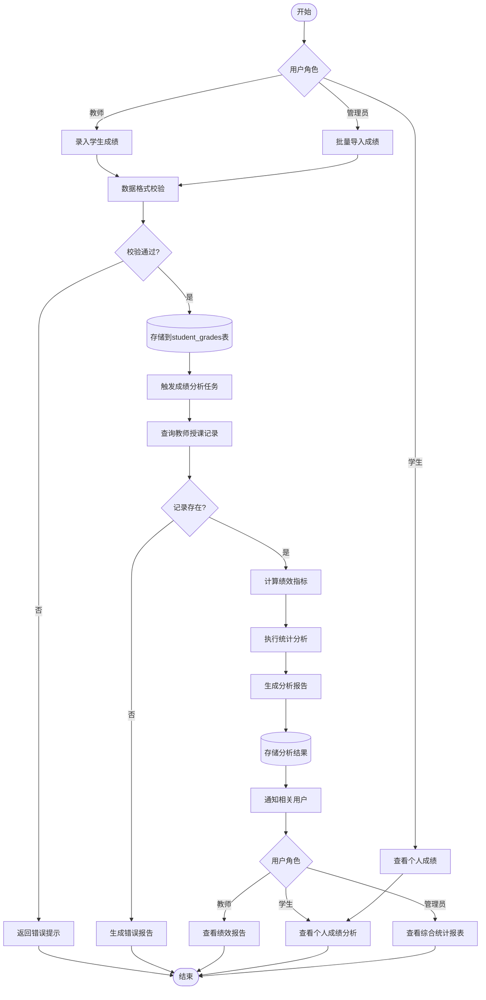
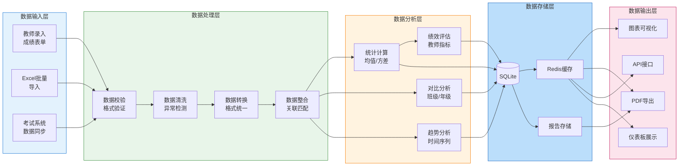
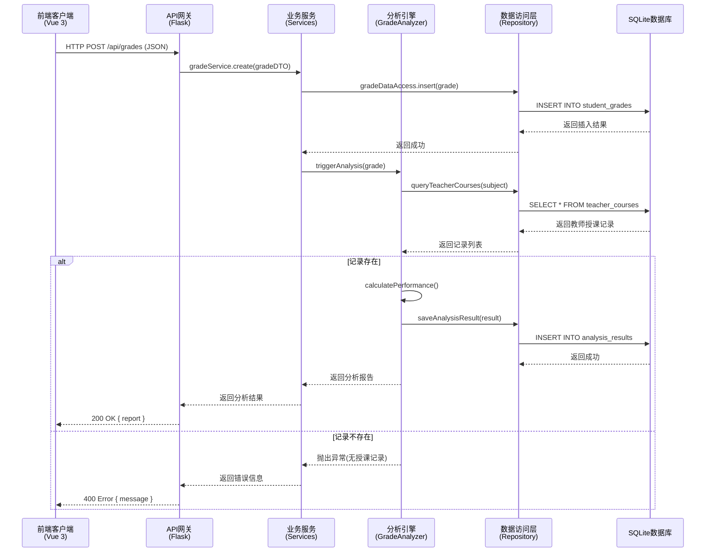

我将先对项目结构进行全面遍历，然后生成详细的项目结构图和专业图表。

toolName: view\_folder

status: success

e:\A\_Course

我已完成项目结构的全面梳理，现在基于准确的项目结构生成专业的Mermaid图表。

***

## 一、项目结构图

```mermaid
flowchart TD
    subgraph 项目根目录[A_Course]
        subgraph 后端[backend/]
            subgraph app[app/]
                subgraph analysis[analysis/]
                    a1[grade_analyzer.py]
                    a2[statistical_analysis.py]
                    a3[decision_tree.py]
                    a4[analysis_explainer.py]
                    a5[intermediate_results.py]
                    a6[analysis_logger.py]
                end
                
                subgraph api[api/]
                    api1[admin_routes.py]
                    api2[analysis_routes.py]
                    api3[auth_routes.py]
                    api4[course_routes.py]
                    api5[exam_routes.py]
                    api6[grade_routes.py]
                    api7[grade_settings_routes.py]
                    api8[student_routes.py]
                    api9[teacher_routes.py]
                end
                
                subgraph data_access[data_access/]
                    da1[grade_data_access.py]
                    da2[grade_settings_data_access.py]
                end
                
                subgraph dto[dto/]
                    dto1[exam_dto.py]
                end
                
                subgraph models[models/]
                    m1[classroom.py]
                    m2[course.py]
                    m3[course_schedule.py]
                    m4[exam.py]
                    m5[grade.py]
                    m6[grade_settings.py]
                    m7[student.py]
                    m8[student_course.py]
                    m9[student_status.py]
                    m10[teacher.py]
                    m11[teacher_course.py]
                    m12[teaching_progress.py]
                    m13[user.py]
                end
                
                subgraph services[services/]
                    s1[conflict_service.py]
                    s2[sync_service.py]
                end
                
                subgraph utils[utils/]
                    u1[response.py]
                end
                
                app_init[__init__.py]
            end
            
            backups[backups/]
            migrations[migrations/]
            app_py[app.py]
        end
        
        subgraph 前端[frontend/]
            subgraph src[src/]
                subgraph components[components/]
                    subgraph business[business/]
                        c_b1[BaseCrudPage.vue]
                        c_b2[BaseManagePage.vue]
                        c_b3[BaseModal.vue]
                        c_b4[Pagination.vue]
                        c_b5[SearchBar.vue]
                    end
                    
                    subgraph common[common/]
                        c_c1[AnalysisProcessVisualizer.vue]
                        c_c2[BaseECharts.vue]
                        c_c3[CollapsibleSection.vue]
                        c_c4[ErrorBoundary.vue]
                        c_c5[LoadingAnimator.vue]
                        c_c6[Notification.vue]
                        c_c7[OfflineNotification.vue]
                    end
                    
                    subgraph course[course/]
                        c_co1[CourseModal.vue]
                        c_co2[CourseTable.vue]
                        c_co3[ProgressModal.vue]
                        c_co4[ProgressTab.vue]
                        c_co5[StudentCourseModal.vue]
                        c_co6[StudentCourseTab.vue]
                        c_co7[TeacherCourseModal.vue]
                        c_co8[TeacherCourseTab.vue]
                    end
                    
                    subgraph dashboard[dashboard/]
                        c_d1[NoticeItem.vue]
                        c_d2[StatisticCard.vue]
                        c_d3[TodoItem.vue]
                    end
                    
                    subgraph grade[grade/]
                        c_g1[GradeChart.vue]
                        c_g2[GradeComparison.vue]
                        c_g3[GradeTrendAnalysis.vue]
                        c_g4[SubjectStrengthAnalysis.vue]
                    end
                    
                    subgraph layout[layout/]
                        c_l1[Layout.vue]
                        c_l2[Sidebar.vue]
                        c_l3[TopTimeDisplay.vue]
                    end
                end
                
                subgraph composables[composables/]
                    comp1[useCrudOperations.ts]
                    comp2[useModal.ts]
                    comp3[usePagination.ts]
                    comp4[useSearch.ts]
                    comp5[useGradeAnalysis.ts]
                    comp6[useClassGrade.ts]
                    comp7[useIndividualGrade.ts]
                end
                
                subgraph services[services/]
                    s_s1[apiService.ts]
                    s_s2[gradeService.ts]
                    s_s3[studentService.ts]
                    s_s4[teacherService.ts]
                    s_s5[courseService.ts]
                    s_s6[examService.ts]
                    s_s7[offlineStorageService.ts]
                end
                
                subgraph stores[stores/]
                    st1[grades.ts]
                    st2[students.ts]
                    st3[teachers.ts]
                    st4[courses.ts]
                    st5[exams.ts]
                    st6[studentStatus.ts]
                end
                
                subgraph views[views/]
                    v1[GradeAnalysis.vue]
                    v2[ClassAnalysis.vue]
                    v3[IndividualAnalysis.vue]
                    v4[StudentManage.vue]
                    v5[TeacherManage.vue]
                    v6[CourseManage.vue]
                    v7[ExamAffairs.vue]
                    v8[login.vue]
                end
                
                router[router/index.js]
                App[App.vue]
                main[main.js]
            end
            
            public[public/]
            config[vite.config.js]
            package[package.json]
        end
    end
```

***

## 二、系统分层架构图

```mermaid
flowchart TB
    subgraph 应用层[应用层 Application Layer]
        style 应用层 fill:#E3F2FD,stroke:#1976D2,stroke-width:2
        
        subgraph 前端组件[Vue 3 组件]
            direction LR
            analysisView[成绩分析视图<br/>GradeAnalysis.vue]
            classView[班级分析视图<br/>ClassAnalysis.vue]
            individualView[个人分析视图<br/>IndividualAnalysis.vue]
            studentManage[学生管理<br/>StudentManage.vue]
            teacherManage[教师管理<br/>TeacherManage.vue]
            courseManage[课程管理<br/>CourseManage.vue]
            examManage[考试管理<br/>ExamAffairs.vue]
            login[登录页面<br/>login.vue]
        end
        
        subgraph 状态管理[Pinia Stores]
            gradesStore[grades.ts]
            studentsStore[students.ts]
            teachersStore[teachers.ts]
            coursesStore[courses.ts]
            examsStore[exams.ts]
        end
    end
    
    subgraph 数据服务层[数据服务层 Data Service Layer]
        style 数据服务层 fill:#E8F5E9,stroke:#388E3C,stroke-width:2
        
        subgraph API路由[Flask REST API]
            direction LR
            authRoutes[认证路由<br/>auth_routes.py]
            studentRoutes[学生路由<br/>student_routes.py]
            teacherRoutes[教师路由<br/>teacher_routes.py]
            courseRoutes[课程路由<br/>course_routes.py]
            gradeRoutes[成绩路由<br/>grade_routes.py]
            examRoutes[考试路由<br/>exam_routes.py]
            analysisRoutes[分析路由<br/>analysis_routes.py]
            adminRoutes[管理路由<br/>admin_routes.py]
        end
        
        subgraph 业务服务[业务服务层]
            conflictService[冲突服务<br/>conflict_service.py]
            syncService[同步服务<br/>sync_service.py]
        end
    end
    
    subgraph 数据分析层[数据分析层 Analysis Layer]
        style 数据分析层 fill:#FFF3E0,stroke:#F57C00,stroke-width:2
        
        subgraph 分析模块[Python分析组件]
            direction LR
            gradeAnalyzer[成绩分析器<br/>grade_analyzer.py]
            statisticalAnalysis[统计分析<br/>statistical_analysis.py]
            decisionTree[决策树分析<br/>decision_tree.py]
            analysisExplainer[分析解释器<br/>analysis_explainer.py]
            intermediateResults[中间结果管理<br/>intermediate_results.py]
        end
    end
    
    subgraph 数据感知层[数据感知层 Data Access Layer]
        style 数据感知层 fill:#FCE4EC,stroke:#C2185B,stroke-width:2
        
        subgraph 数据访问[Repository模式]
            direction LR
            gradeDataAccess[成绩数据访问<br/>grade_data_access.py]
            gradeSettingsAccess[设置数据访问<br/>grade_settings_data_access.py]
        end
        
        subgraph 数据库模型[SQLAlchemy模型]
            studentModel[Student]
            teacherModel[Teacher]
            courseModel[Course]
            gradeModel[Grade]
            examModel[Exam]
            teacherCourseModel[TeacherCourse]
            studentCourseModel[StudentCourse]
        end
        
        database[(SQLite数据库)]
    end
    
    应用层 -->|HTTP/REST JSON| 数据服务层
    数据服务层 -->|方法调用| 数据分析层
    数据分析层 -->|数据查询| 数据感知层
    数据感知层 -->|SQL| database
    
    linkStyle 0 stroke:#1976D2,stroke-width:2,color:#1976D2
    linkStyle 1 stroke:#388E3C,stroke-width:2,color:#388E3C
    linkStyle 2 stroke:#F57C00,stroke-width:2,color:#F57C00
    linkStyle 3 stroke:#C2185B,stroke-width:2,color:#C2185B
```

***

## 三、成绩分析系统业务流程图

***

## 四、数据流向图

***

## 五、层级交互协议图

***

## 图表使用说明

### 1. 项目结构图

- 展示了前后端完整的目录结构
- 清晰呈现各模块之间的从属关系
- 可直接用于项目文档和架构说明

### 2. 系统分层架构图

- 精确展示四层架构：应用层→数据服务层→数据分析层→数据感知层
- 标注了各层的核心组件和技术实现
- 使用颜色区分不同层级，便于识别

### 3. 成绩分析业务流程图

- 完整展示成绩数据的全生命周期
- 包含所有关键决策点和分支流程
- 标注了异常处理机制
- 使用颜色区分不同处理阶段

### 4. 数据流向图

- 展示数据从输入到输出的完整路径
- 包含数据校验、清洗、转换、分析等环节
- 清晰呈现数据存储和输出方式

### 5. 层级交互协议图

- 使用时序图展示各层级之间的调用关系
- 包含正常流程和异常流程的处理
- 标注了数据格式和协议类型

以上图表均符合Mermaid语法规范，可直接复制到支持Mermaid渲染的平台（如GitHub、GitLab、Markdown文档等）中使用。
