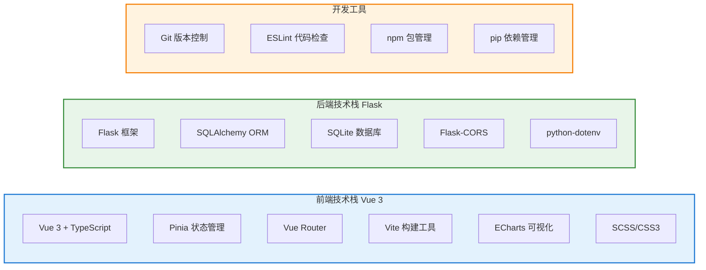
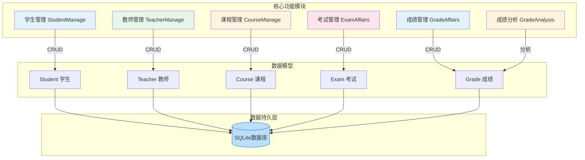
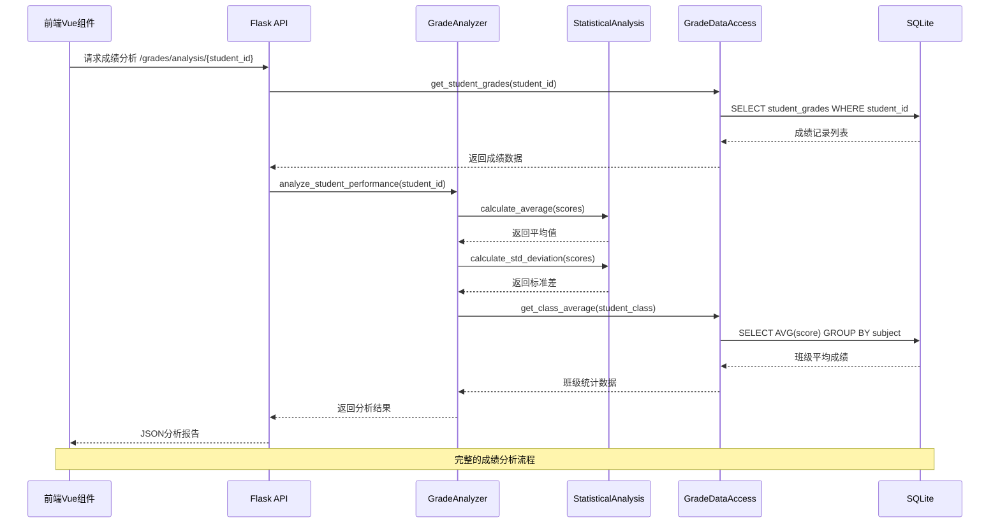

# 学校管理系统 - 项目结构图

## 一、项目整体结构

```mermaid
flowchart TB
    subgraph A_Course[学校管理系统 A_Course]
        subgraph backend[backend/ Flask后端]
            subgraph backend_app[app/ 应用模块]
                subgraph analysis[analysis/ 成绩分析核心模块]
                    a1["grade_analyzer.py<br/>成绩分析器 - 个人/班级/年级成绩分析"]
                    a2["statistical_analysis.py<br/>统计分析工具 - 均值/标准差/中位数/分布计算"]
                    a3["decision_tree.py<br/>决策树分析 - 成绩分类与预测"]
                    a4["analysis_explainer.py<br/>分析解释器 - 生成分析步骤说明"]
                    a5["intermediate_results.py<br/>中间结果管理 - 存储分析过程数据"]
                    a6["analysis_logger.py<br/>分析日志记录 - 追踪分析执行流程"]
                end

                subgraph api[api/ REST API路由]
                    api1["admin_routes.py<br/>管理员路由"]
                    api2["analysis_routes.py<br/>分析过程可视化API"]
                    api3["auth_routes.py<br/>认证授权路由"]
                    api4["course_routes.py<br/>课程管理路由"]
                    api5["exam_routes.py<br/>考试管理路由"]
                    api6["grade_routes.py<br/>成绩管理路由"]
                    api7["grade_settings_routes.py<br/>成绩设置路由"]
                    api8["student_routes.py<br/>学生管理路由"]
                    api9["teacher_routes.py<br/>教师管理路由"]
                end

                subgraph data_access[data_access/ 数据访问层]
                    da1["grade_data_access.py<br/>成绩数据访问 - 查询/统计"]
                    da2["grade_settings_data_access.py<br/>成绩设置数据访问"]
                end

                subgraph models[models/ SQLAlchemy数据模型]
                    m1["classroom.py 教室模型"]
                    m2["course.py 课程模型"]
                    m3["course_schedule.py 课程表模型"]
                    m4["exam.py 考试模型"]
                    m5["grade.py 成绩模型"]
                    m6["grade_settings.py 成绩设置模型"]
                    m7["student.py 学生模型"]
                    m8["student_course.py 学生课程模型"]
                    m9["student_status.py 学生状态模型"]
                    m10["teacher.py 教师模型"]
                    m11["teacher_course.py 教师课程模型"]
                    m12["teaching_progress.py 教学进度模型"]
                    m13["user.py 用户模型"]
                end

                subgraph services[services/ 业务服务层]
                    s1["conflict_service.py 冲突检测服务"]
                    s2["sync_service.py 数据同步服务"]
                end

                subgraph dto[dto/ 数据传输对象]
                    dto1["exam_dto.py 考试数据传输对象"]
                end

                subgraph utils[utils/ 工具函数]
                    u1["response.py 响应格式化工具"]
                end
            end

            backend_root["app.py Flask应用入口<br/>migrations/ 数据库迁移脚本<br/>backups/ 数据库备份"]
        end

        subgraph frontend[frontend/ Vue 3前端]
            subgraph src[src/ 源代码目录]
                subgraph components[components/ Vue组件]
                    subgraph business[business/ 业务通用组件]
                        bc1["BaseCrudPage.vue 增删改查页面基类"]
                        bc2["BaseManagePage.vue 管理页面基类"]
                        bc3["BaseModal.vue 模态框基类"]
                        bc4["Pagination.vue 分页组件"]
                        bc5["SearchBar.vue 搜索栏组件"]
                    end

                    subgraph common[common/ 通用组件]
                        cc1["AnalysisProcessVisualizer.vue 分析过程可视化"]
                        cc2["BaseECharts.vue ECharts图表基类"]
                        cc3["CollapsibleSection.vue 可折叠区域"]
                        cc4["ErrorBoundary.vue 错误边界"]
                        cc5["LoadingAnimator.vue 加载动画"]
                        cc6["Notification.vue 通知组件"]
                        cc7["OfflineNotification.vue 离线通知"]
                    end

                    subgraph course[course/ 课程组件]
                        cco1["CourseModal.vue 课程模态框"]
                        cco2["CourseTable.vue 课程表格"]
                        cco3["ProgressModal.vue 进度模态框"]
                        cco4["ProgressTab.vue 进度选项卡"]
                        cco5["StudentCourseModal.vue 学生课程模态框"]
                        cco6["StudentCourseTab.vue 学生课程选项卡"]
                        cco7["TeacherCourseModal.vue 教师课程模态框"]
                        cco8["TeacherCourseTab.vue 教师课程选项卡"]
                    end

                    subgraph dashboard[dashboard/ 仪表盘组件]
                        cd1["NoticeItem.vue 通知项"]
                        cd2["StatisticCard.vue 统计卡片"]
                        cd3["TodoItem.vue 待办事项项"]
                    end

                    subgraph grade[grade/ 成绩分析组件]
                        cg1["GradeChart.vue 成绩图表 - 柱状/折线/饼图"]
                        cg2["GradeComparison.vue 成绩对比组件"]
                        cg3["GradeTrendAnalysis.vue 成绩趋势分析"]
                        cg4["SubjectStrengthAnalysis.vue 学科强弱项分析"]
                    end

                    subgraph layout[layout/ 布局组件]
                        cl1["Layout.vue 主布局"]
                        cl2["Sidebar.vue 侧边栏"]
                        cl3["TopTimeDisplay.vue 顶部时间显示"]
                    end
                end

                subgraph composables[composables/ 组合式函数]
                    subgraph api[api/ API操作]
                        comp_api["useCrudOperations.ts CRUD操作"]
                    end

                    subgraph common[common/ 通用]
                        comp_common["useArchive.ts 归档<br/>useLocalStorage.ts 本地存储<br/>useModal.ts 模态框<br/>usePagination.ts 分页<br/>useSearch.ts 搜索"]
                    end

                    subgraph course[couse/ 课程相关]
                        comp_course["useCourseCommon.ts 课程通用<br/>useCourseManage.ts 课程管理<br/>useCourseTable.ts 课程表格<br/>useStudentCourse.ts 学生课程<br/>useTeacherCourse.ts 教师课程<br/>useTeachingProgress.ts 教学进度"]
                    end

                    subgraph exam[exam/ 考试相关]
                        comp_exam["useExamManage.ts 考试管理<br/>useExamNotice.ts 考试通知"]
                    end

                    subgraph grade[grade/ 成绩分析]
                        comp_grade["useClassGrade.ts 班级成绩<br/>useGradeAnalysis.ts 成绩分析<br/>useIndividualGrade.ts 个人成绩"]
                    end

                    subgraph layout[layout/ 布局]
                        comp_layout["useLayout.ts 布局管理"]
                    end

                    subgraph student[student/ 学生管理]
                        comp_student["useStudentManage.ts 学生管理<br/>useStudentStatusManage.ts 学生状态管理"]
                    end

                    subgraph teacher[teacher/ 教师管理]
                        comp_teacher["useTeacherManage.ts 教师管理"]
                    end

                    subgraph validation[validation/ 验证]
                        comp_validation["useValidation.ts 数据验证"]
                    end
                end

                subgraph services[services/ API服务层]
                    svc1["apiService.ts API基础服务"]
                    svc2["gradeService.ts 成绩分析服务"]
                    svc3["studentService.ts 学生服务"]
                    svc4["teacherService.ts 教师服务"]
                    svc5["courseService.ts 课程服务"]
                    svc6["examService.ts 考试服务"]
                    svc7["notificationService.ts 通知服务"]
                    svc8["offlineStorageService.ts 离线存储服务"]
                    svc9["uiNotificationService.ts UI通知服务"]
                end

                subgraph stores[stores/ Pinia状态管理]
                    store1["grades.ts 成绩状态"]
                    store2["students.ts 学生状态"]
                    store3["teachers.ts 教师状态"]
                    store4["courses.ts 课程状态"]
                    store5["exams.ts 考试状态"]
                    store6["studentStatus.ts 学生状态"]
                end

                subgraph views[views/ 页面视图]
                    subgraph adminDashboard[adminDashboard/]
                        v_admin["AdminDashboard.vue 管理员仪表盘"]
                    end

                    subgraph course_views[course/]
                        v_course1["ProgressPage.vue 教学进度页面"]
                        v_course2["StudentCoursePage.vue 学生课程页面"]
                        v_course3["TeacherCoursePage.vue 教师课程页面"]
                    end

                    subgraph courseManage[courseManage/]
                        v_coursem["CourseManage.vue 课程管理"]
                    end

                    subgraph examManage[examManage/]
                        v_exam["ExamAffairs.vue 考试事务"]
                    end

                    subgraph gradeAnalysis[gradeAnalysis/ 成绩分析]
                        v_grade1["GradeAnalysis.vue 成绩分析主页面"]
                        v_grade2["ClassAnalysis.vue 班级分析"]
                        v_grade3["IndividualAnalysis.vue 个人分析"]
                        v_grade4["GradeLevelAnalysis.vue 年级分析"]
                    end

                    subgraph login[login/]
                        v_login["login.vue 登录页面"]
                    end

                    subgraph studentManage[studentManage/]
                        v_student1["StudentManage.vue 学生管理"]
                        v_student2["StudentStatus.vue 学生状态"]
                    end

                    subgraph teacherManage[teacherManage/]
                        v_teacher["TeacherManage.vue 教师管理"]
                    end
                end

                subgraph router[router/]
                    r_index["index.js Vue路由配置"]
                end

                src_root["App.vue 根组件<br/>main.js 入口文件<br/>style.css 全局样式<br/>vite-env.d.ts Vite类型定义"]
            end

            frontend_config["package.json<br/>vite.config.js<br/>tsconfig.json<br/>index.html<br/>.eslintrc.js"]
        end
    end

    style backend fill:#E3F2FD,stroke:#1976D2,stroke-width:2
    style frontend fill:#E8F5E9,stroke:#388E3C,stroke-width:2
    style analysis fill:#FFF3E0,stroke:#F57C00,stroke-width:2
    style gradeAnalysis fill:#FCE4EC,stroke:#C2185B,stroke-width:2
```

## 二、项目技术栈概览

## 三、核心功能模块关系

## 四、成绩分析数据流

## 五、图表索引

| 图表编号 | 图表名称 | 说明 |
|---------|---------|------|
| 图1 | 项目整体结构图 | 展示前后端完整目录结构和文件组织 |
| 图2 | 项目技术栈概览 | 展示前后端使用的技术框架和工具 |
| 图3 | 核心功能模块关系 | 展示各管理模块与数据模型的关联 |
| 图4 | 成绩分析数据流 | 展示分析请求的完整调用链路 |

---

**文档版本**: 2.0
**生成日期**: 2026-04-28
**适用项目**: 学校管理系统 (A_Course)
